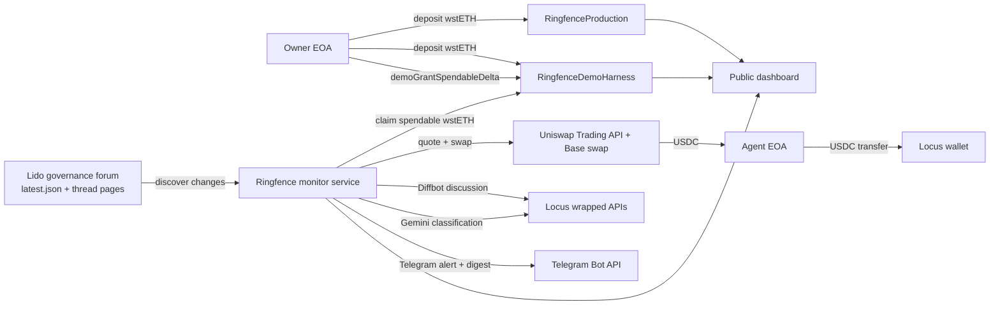

# Ringfence

Ringfence is a yield-backed operating treasury for AI agents. It uses `wstETH` as the backing asset, protects principal at the contract level, allows only bounded spendable value to flow to the agent, converts that spendable value into `USDC` via Uniswap on Base, and executes real payments through Locus.

This repo now runs Ringfence as a live Lido governance monitor:
- a public dashboard shows treasury state, recent governance changes, alerts, digests, and onchain/runtime activity
- an hourly monitor watches the Lido governance forum
- `MATERIAL` changes trigger immediate Telegram alerts
- a daily digest goes out at `18:00 UTC`
- the monitor only refills its Locus budget when the configured USDC buffer is low

## Repo Shape

- `contracts/`: `RingfenceProduction` and `RingfenceDemoHarness`
- `script/`: Foundry deployment script
- `test/`: Solidity unit and fork tests
- `src/`: TypeScript CLI, monitor runtime, and dashboard service
- `docs/`: architecture and judging/demo notes
- `config/`: defaults, deployments, and persisted runtime state

## Architecture



See [docs/architecture.md](docs/architecture.md).

## Contracts

### `RingfenceProduction`

- stores `principalBaseline` in stETH-value terms
- derives Base-mainnet `wstETH` value from the `wstETH/stETH` rate feed
- computes claimable `wstETH` from `currentPositionValue - principalBaseline`
- enforces owner-only config, agent-only claim, whitelist, and per-tx cap
- contains no demo backdoor

### `RingfenceDemoHarness`

- preserves the production interface and checks
- adds explicit `demoGrantSpendableDelta(uint256 deltaStETH)`
- adds explicit `demoResetSpendableDelta()` for repeatable demos
- exposes `demoSpendableDeltaStETH()` onchain
- does not claim to represent fresh accrued Lido yield

## Monitor Flow

1. Discover recent Lido governance topics from `https://research.lido.fi/latest.json`.
2. Compare the forum feed against persisted topic snapshots.
3. If nothing changed, record a `NONE` heartbeat and stop.
4. If topics changed:
   - ensure the Locus USDC buffer is funded; refill from Ringfence only if needed
   - call `diffbot/discussion` for changed topics
   - call `gemini/chat` with `gemini-3-flash-preview` for structured classification
   - classify the run as `NONE`, `MINOR`, or `MATERIAL`
5. Send an immediate Telegram alert only for newly material topics.
6. Send a daily digest at `18:00 UTC` with all `MINOR` and `MATERIAL` changes since the prior digest.
7. Update the public dashboard after every run.

## Setup

1. Use Node 20:
   ```bash
   nvm use
   ```
2. Install JS dependencies:
   ```bash
   pnpm install
   ```
3. Copy `.env.example` to `.env` and fill in:
   - Base RPC and signer keys
   - deployer key for contract deployment
   - deployed contract addresses
   - `WSTETH_STETH_RATE_FEED_ADDRESS` for Base
   - Uniswap API key
   - Locus API key and wallet address
   - Telegram bot token and chat id
4. Run checks:
   ```bash
   pnpm run check
   pnpm run test:unit
   forge test
   ```

## CLI

### State and owner actions

- `pnpm run cli -- state --contract production`
- `pnpm run cli -- owner deposit --contract demo --amount 0.05`
- `pnpm run cli -- owner set-agent --contract demo --agent 0x...`
- `pnpm run cli -- owner whitelist --contract demo --recipient 0x... --allowed true`
- `pnpm run cli -- owner set-cap --contract demo --amount 0.01`
- `pnpm run cli -- owner demo-grant-delta --amount 0.005`
- `pnpm run cli -- owner demo-reset-delta`

### Low-level treasury debugging

- `pnpm run cli -- demo fail-claim --contract demo --amount 1 --recipient 0x...`
- `pnpm run cli -- agent claim --contract demo`
- `pnpm run cli -- agent approve-swap --amount 0.005`
- `pnpm run cli -- agent swap --amount 0.005`
- `pnpm run cli -- agent topup-locus --amount 5`

### Governance monitor

- `pnpm run cli -- monitor preflight --contract demo`
- `pnpm run cli -- monitor hourly --contract demo`
- `pnpm run cli -- monitor digest --contract demo`
- `pnpm run serve`

## Dashboard Service

Default local service:
- public dashboard: `GET /`
- admin page: `GET /admin?token=...`
- public state: `GET /api/public/state`
- public run history: `GET /api/public/runs`
- public digests: `GET /api/public/digests`
- admin hourly trigger: `POST /api/admin/monitor/hourly`
- admin digest trigger: `POST /api/admin/monitor/digest`
- admin preflight: `POST /api/admin/monitor/preflight`

Admin endpoints require `DASHBOARD_ADMIN_TOKEN`.

## Deployment

Deploy both contracts with Foundry:

```bash
forge script script/DeployRingfence.s.sol:DeployRingfence \
  --rpc-url "$BASE_RPC_URL" \
  --broadcast
```

The deploy script writes `config/deployments.json`, which the CLI and monitor service consume.
`config/deployments.json` and `config/runtime-state.json` are generated local artifacts and are intentionally gitignored.

Optional verification on BaseScan with Foundry:

```bash
forge verify-contract --watch \
  --chain base \
  --verifier etherscan \
  --etherscan-api-key "$ETHERSCAN_API_KEY" \
  <DEPLOYED_CONTRACT_ADDRESS> \
  contracts/RingfenceProduction.sol:RingfenceProduction
```

For the live monitor demo, keep `MIN_CLAIM_AMOUNT_WSTETH` below your expected refill size. The template defaults to `0.001` `wstETH` so small demo refills are not blocked.

## Live Product Notes

- Production proves the canonical value-based `wstETH` accounting model.
- On Base, the contracts use the `wstETH/stETH` rate feed because the bridged Base token does not expose the mainnet wrapper conversion helpers.
- The demo harness is the default funding source for the live judging window.
- The monitor is intentionally Classic-only on Uniswap by request shaping; any non-Classic route aborts loudly.
- Locus defaults to beta unless production credentials are explicitly configured.
- Telegram replaces Resend for outbound operator notifications.
- The public dashboard is read-only. Manual reruns and digest sends stay behind the admin token.

## References

- [Uniswap Trading API integration guide](https://api-docs.uniswap.org/guides/integration_guide)
- [Locus Quick Start (Beta)](https://docs.paywithlocus.com/quickstart-beta)
- [Lido governance forum](https://research.lido.fi/)
