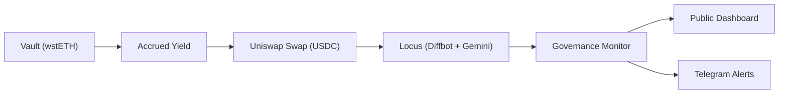

# Ringfence

**Ringfence is a yield-backed operating treasury for AI agents that separates capital from computation.**

It separates **principal from yield**, enforces that separation **onchain**, and allows agents to fund ongoing compute, data, and communication costs without ever being able to spend the underlying capital.

This repository runs Ringfence as a **live system**:

- a yield-backed treasury (`wstETH` on Base)
- an autonomous agent that monitors Lido governance
- a funding loop that converts yield -> USDC -> paid intelligence
- a public dashboard showing system state and activity

> This is not a mock.
>
> Ringfence runs on **Base mainnet**, holds real `wstETH`, executes real swaps via **Uniswap**, pays for real analysis through **Locus**, and sends live alerts via **Telegram**.
>
> Every step in the loop is executed with real assets, real APIs, and publicly verifiable transactions.

## Why Ringfence

Most agent systems today:

- require pre-funded wallets
- can drain capital through error, compromise, or bad incentives
- are economically finite

Ringfence changes that model:

> **Agents can operate with real budgets without ever taking custody of capital.**

In this deployment:

- principal is **structurally inaccessible** to the agent
- only **derived yield** becomes spendable
- spend is **bounded and permissioned onchain**
- the agent converts yield -> USDC -> pays for external services
- the system runs continuously and publishes its behavior publicly

This is the primitive behind **persistent agents**, **yield-backed infrastructure**, and **autonomous digital services that do not need custody of their own capital**.

## Live System

### Public Endpoints

- Public dashboard: [ringfence-zeta.vercel.app](https://ringfence-zeta.vercel.app/)
- Lido governance forum source: [research.lido.fi](https://research.lido.fi/)

### Base Mainnet Deployment

- Chain: `Base`
- Owner / deployer: [`0x545e724cb534777c28F518698D0190704ceb55AB`](https://basescan.org/address/0x545e724cb534777c28F518698D0190704ceb55AB)
- Agent: [`0x56D96e30A02aC5839b37f2Ce33605eE6de11B704`](https://basescan.org/address/0x56D96e30A02aC5839b37f2Ce33605eE6de11B704)
- Production contract: [`0x23ab3A219952398cADF954AD392E8dB756D8607f`](https://basescan.org/address/0x23ab3A219952398cADF954AD392E8dB756D8607f)
- Demo contract: [`0xa45eEDa937E58eC51Ea967C415afbEcEE9e95a36`](https://basescan.org/address/0xa45eEDa937E58eC51Ea967C415afbEcEE9e95a36)
- `wstETH/stETH` rate feed: [`0xB88BAc61a4Ca37C43a3725912B1f472c9A5bc061`](https://basescan.org/address/0xB88BAc61a4Ca37C43a3725912B1f472c9A5bc061)

The production vault is funded and accruing real yield.

The system is running live and updating the public dashboard.

The demo harness is used solely to initiate the live execution loop and allow the system behavior to be continuously demonstrable.

## Live Behavior

Ringfence is not a static demo. It is an **always-on system**.

### Every Hour

1. Monitor the Lido governance forum.
2. Detect new or changed discussions.
3. If changes exist:
   - fund Locus conditionally
   - scrape and analyze discussions
   - classify impact
4. Publish results to the dashboard.
5. Send alerts if needed.

### Notifications

- `MATERIAL` -> immediate Telegram alert
- Daily digest -> `18:00 UTC`

### Funding

- yield is claimed only when needed
- swaps execute via Uniswap on Base
- `USDC` funds Locus for Diffbot + Gemini

## System Loop



## Architecture

Ringfence combines an **onchain treasury invariant** with an **offchain agent runtime**.

### Onchain

- value-based principal accounting in `stETH` terms
- strict agent permissions through whitelist + per-transaction cap
- claimable yield derived from real market value
- owner-controlled principal recovery

### Offchain

- TypeScript agent runtime and CLI
- Uniswap Trading API integration
- Locus paid API usage for Diffbot + Gemini
- Telegram broadcasting
- persistent monitor state and public dashboard

## Documentation

- [Architecture notes](docs/architecture.md)
- [Demo script](docs/demo-script.md)
- [Conversation log](docs/conversation-log.md)

## Contracts

### `RingfenceProduction`

The canonical primitive:

- principal stored as a `stETH`-value baseline
- claimable = `max(current value - baseline, 0)`
- agent can only claim bounded yield

Includes:

- whitelist enforcement
- per-transaction cap
- oracle-based valuation via Chainlink-compatible rate feed
- owner-only principal withdrawal
- stale oracle protection

### `RingfenceDemoHarness`

The same surface, plus:

- explicit demo-only spendable delta
- repeatable live execution loop
- no hidden behavior

It exists to prove the operating loop live without weakening the production invariant.

## What Is Proven Onchain

Ringfence proves, in a live deployment, that:

- principal cannot be accessed by the agent
- claimable yield is computed and enforced onchain
- bounded claims execute successfully
- real swaps occur via Uniswap on Base
- `USDC` is transferred onchain for paid API usage

Example flow already executed:

```text
claim -> swap -> fund intelligence -> analyze -> broadcast
```

All transactions are public and verifiable.

## Live Proof

### Deployment Transactions

- Production deploy: [`0x5281231090ea16672de457271d6d21f58be45f6937d945339868141234ed9adf`](https://basescan.org/tx/0x5281231090ea16672de457271d6d21f58be45f6937d945339868141234ed9adf)
- Demo deploy: [`0xa022a43f7e4697ec7dca8720f9331c1fc7129a32153253c98e397725c8427e17`](https://basescan.org/tx/0xa022a43f7e4697ec7dca8720f9331c1fc7129a32153253c98e397725c8427e17)

### Funding and Execution Transactions

- Production `deposit(0.1 wstETH)`: [`0xb671e43360e6908afcc14bcf9da9f01666b7ffc0adff74aa99d146cb097d3ab4`](https://basescan.org/tx/0xb671e43360e6908afcc14bcf9da9f01666b7ffc0adff74aa99d146cb097d3ab4)
- Demo `setAgent`: [`0x37092a43bbf2ed2c3521420a8abfea2068c7a9dbad9153aaa8cdea9f36e60cbe`](https://basescan.org/tx/0x37092a43bbf2ed2c3521420a8abfea2068c7a9dbad9153aaa8cdea9f36e60cbe)
- Demo `setRecipientWhitelist`: [`0x10b015376d00e1fd27a599eda0de72bb3b2335c8cb02ad275b0b31956284195f`](https://basescan.org/tx/0x10b015376d00e1fd27a599eda0de72bb3b2335c8cb02ad275b0b31956284195f)
- Demo `setPerTxCap(0.001 wstETH)`: [`0xda991465a5a8cf596ed360d0877da362434a219ebe88e96e6c3c6898dfb14b59`](https://basescan.org/tx/0xda991465a5a8cf596ed360d0877da362434a219ebe88e96e6c3c6898dfb14b59)
- Demo `approve(0.01 wstETH)`: [`0x13c5daf5c278c1d0dc28d2280a0b3b015ebd6cf14f5cd7899573594da3d5809b`](https://basescan.org/tx/0x13c5daf5c278c1d0dc28d2280a0b3b015ebd6cf14f5cd7899573594da3d5809b)
- Demo `deposit(0.01 wstETH)`: [`0x23e4ce117a343aa5fe56bfc673f72075f5835fdaaeab316e8db5d76beb8b3de8`](https://basescan.org/tx/0x23e4ce117a343aa5fe56bfc673f72075f5835fdaaeab316e8db5d76beb8b3de8)
- Demo `demoGrantSpendableDelta(0.0015 stETH-value)`: [`0xc1565efd81fb20557361afad4ce9525a935708726be0a5ea82eb33f2c41207d3`](https://basescan.org/tx/0xc1565efd81fb20557361afad4ce9525a935708726be0a5ea82eb33f2c41207d3)
- Demo `claim(0.001 wstETH)`: [`0x0f0c56e92a873cb0c0672ed1dcbfb5a11f0d6d18411846eb8ae06e5063b26068`](https://basescan.org/tx/0x0f0c56e92a873cb0c0672ed1dcbfb5a11f0d6d18411846eb8ae06e5063b26068)
- Uniswap Base swap: [`0x6451fb28ec1468499c20951bca51466ad0d29a1e201b6b054d5baa9a3f680328`](https://basescan.org/tx/0x6451fb28ec1468499c20951bca51466ad0d29a1e201b6b054d5baa9a3f680328)
- Locus top-up: [`0xf5fa1a9930ab958c8144132769a9616db08e8cd706e5818a0400544ab75e3e93`](https://basescan.org/tx/0xf5fa1a9930ab958c8144132769a9616db08e8cd706e5818a0400544ab75e3e93)

## Dashboard

The system exposes a public, read-only dashboard showing:

- vault balance and principal baseline
- current position value and claimable yield
- Locus `USDC` buffer
- recent runs (`NONE`, `MINOR`, `MATERIAL`)
- governance topic summaries
- alerts and daily digests
- transaction history
- system heartbeat

The dashboard reflects the live state of the agent and treasury.

## CLI

### Core

```bash
pnpm run cli -- state --contract demo
pnpm run cli -- state --contract production
pnpm run cli -- owner set-agent --contract demo --agent 0x...
pnpm run cli -- owner whitelist --contract demo --recipient 0x... --allowed true
pnpm run cli -- owner set-cap --contract demo --amount 0.001
pnpm run cli -- owner deposit --contract demo --amount 0.01
pnpm run cli -- owner demo-grant-delta --amount 0.0015
pnpm run cli -- owner demo-reset-delta
```

### Agent

```bash
pnpm run cli -- agent claim --contract demo
pnpm run cli -- agent approve-swap --amount 0.001
pnpm run cli -- agent swap --amount 0.001
pnpm run cli -- agent topup-locus --amount 1
```

### Monitor

```bash
pnpm run cli -- monitor hourly --contract demo
pnpm run cli -- monitor digest --contract demo
pnpm run cli -- monitor preflight --contract demo
pnpm run serve
```

### Diagnostics

```bash
pnpm run cli -- demo fail-claim --contract demo --amount 1 --recipient 0x...
pnpm run cli -- demo fail-withdraw-principal --contract demo --amount 0.001 --recipient 0x...
pnpm run cli -- locus smoke --topic-url https://research.lido.fi/t/... 
```

## Key Design Decisions

### Value-Based Accounting (`stETH`)

`wstETH` does not rebase. Value accrues through the exchange rate, so Ringfence accounts for principal in `stETH`-value terms rather than raw wrapped balance.

### Buffer-Driven Spending

The agent does not claim continuously. It claims only when the offchain budget actually needs replenishment.

### Separation of Concerns

- `RingfenceProduction` = the invariant
- `RingfenceDemoHarness` = the execution surface

### No Custody Risk

The agent cannot access principal under any condition. It can only claim spendable yield within explicit onchain bounds.

## Setup

```bash
nvm use
pnpm install
cp .env.example .env
pnpm run check
pnpm run test:unit
forge test
```

Fill `.env` with:

- Base RPC and signer keys
- deployer key for contract deployment
- deployed contract addresses
- Uniswap API key
- Locus API key and wallet address
- Telegram bot token and chat id

## Deployment

```bash
forge script script/DeployRingfence.s.sol:DeployRingfence \
  --rpc-url "$BASE_RPC_URL" \
  --broadcast
```

Optional BaseScan verification:

```bash
forge verify-contract --watch \
  --chain base \
  --verifier etherscan \
  --etherscan-api-key "$ETHERSCAN_API_KEY" \
  <DEPLOYED_CONTRACT_ADDRESS> \
  contracts/RingfenceProduction.sol:RingfenceProduction
```

## References

- [Uniswap Trading API](https://api-docs.uniswap.org/)
- [Locus Docs](https://docs.paywithlocus.com/)
- [Lido Governance Forum](https://research.lido.fi/)
